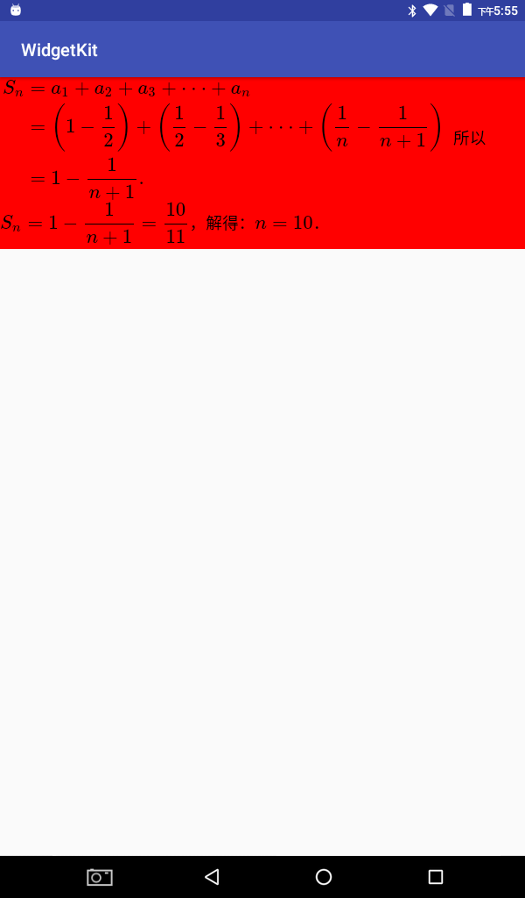

MathView

展示数学公式的View。基于MathJax的封装，删除了一些不必要的文件。



*******

##### 使用

自定义网络加载框架
```java


```

```java

        String test = "\\( \\begin{split}{S_n} &= {a_1} + {a_2} + {a_3} + \\cdot \\cdot \\cdot +{a_n} \\\\&= \\left( {1 - \\dfrac{1}{2}} \\right) + \\left( {\\dfrac{1}{2} - \\dfrac{1}{3}} \\right) + \\cdot \\cdot \\cdot + \\left( {\\dfrac{1}{n} - \\dfrac{1}{n + 1}} \\right)\\\\ &= 1 - \\dfrac{1}{n + 1}.\\end{split}\\) 所以 \\({S_n} = 1 - \\dfrac{1}{n + 1}=\\dfrac{10}{11}\\)，解得：\\(n = 10\\)．";
        mathView.setText(test);

        mathView.setMathRenderInterface(new MathRenderInterface() {
            @Override
            public void beginRender(MathView mathView) {
            //开始渲染
                Toast.makeText(MathViewSimple.this, "render begin", Toast.LENGTH_SHORT).show();
            }

            @Override
            public void endRender(MathView mathView) {
            //结束渲染
                Toast.makeText(MathViewSimple.this, "render end", Toast.LENGTH_SHORT).show();
            }
        });

```
